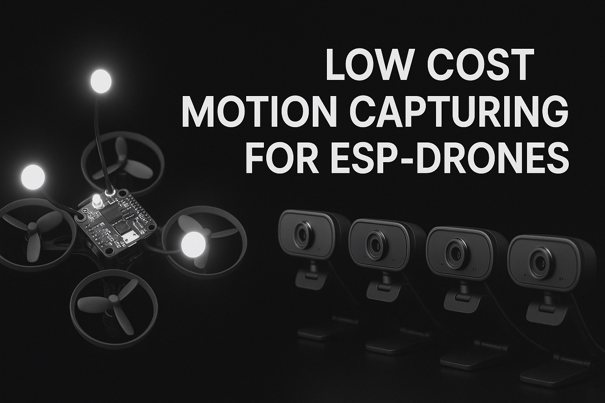

# Low-Cost Mocap for ESP32 Drones

**A general-purpose motion capture system for autonomous indoor drone flight**

This project extends [Joshua Bird's Low-Cost Mocap](https://github.com/jyjblrd/Low-Cost-Mocap) to track affordable ESP32 drones without requiring OpenCV's SfM module.

## Demo Video

[](https://youtu.be/-AZVHd_bZnI)

## Quick Start

### Prerequisites
- Python 3.8+
- Node.js 18+

### Installation

1. **Install the pseyepy Library:** [https://github.com/bensondaled/pseyepy](https://github.com/bensondaled/pseyepy)

2. **Install Python dependencies**
   ```bash
   cd computer_code
   pip install -r requirements.txt
   ```

3. **Install frontend dependencies**
   ```bash
   cd frontend
   npm install
   ```

### Running the System

1. **Start the frontend** (in `computer_code/frontend/`)
   ```bash
   npm run dev
   ```
   Access the web interface at the provided URL (typically `http://localhost:3000`)

2. **Start the backend** (in `computer_code/`)
   ```bash
   python src/api.py
   ```

## Project Structure

```
├── computer_code/           # Main software
│   ├── src/                # Python backend
│   ├── frontend/           # Next.js web interface  
│   ├── scripts/            # Calibration utilities
│   └── poses/             # Recorded tracking data
├── sender_esp32/           # ESP32 drone firmware
├── receiver_esp32/         # ESP32 receiver firmware
└── 3d_files/              # STL files for camera mounts
```

---

*Based on the original work by [Joshua Bird](https://github.com/jyjblrd/Low-Cost-Mocap)*


